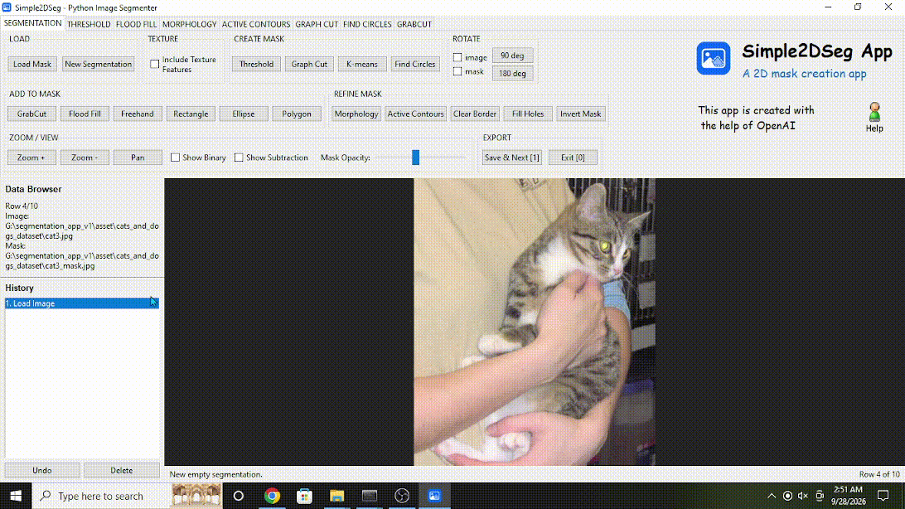
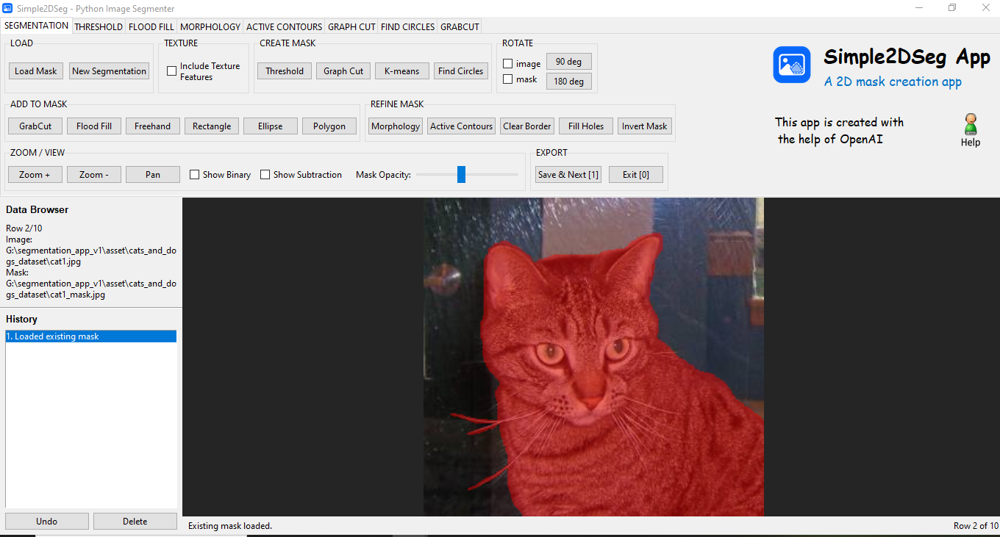
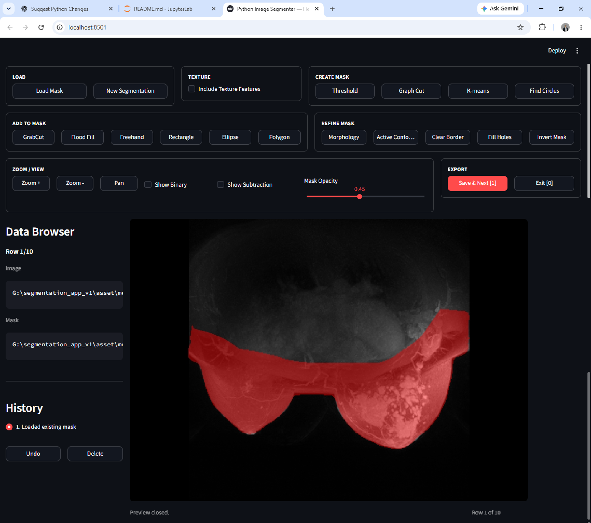

# 🧩 Simple 2D Image Segmenter UI

This application can be used locally or on a headless server to create segmentation masks for 2D images.
It provides a Tkinter-based desktop application for Windows, Linux, and macOS, together with a Streamlit application that can run across platforms, including headless servers.

The UI mimics semi-automated segmentation tools in MATLAB 2018.

Further information can be obtained by writing to Arka Bhowmik (arkabhowmik@yahoo.co.uk).

The following animation demonstrates a typical segmentation workflow.
<p align="left">

</p>

## ⊞ Windows app / 🐧 Linux app / 🍎 macOS app

Follow the steps below to run the Tkinter desktop application.



Use the files in the application folder and follow the steps below.

#### Step I: Install Python

Open **Command Prompt/Terminal** and run the appropriate commands for your operating system.

**Windows**

```cmd
winget install Python.Python.3.12
```

**Linux (Debian/Ubuntu-based systems)**

```bash
sudo apt-get update
sudo apt-get install -y python3 python3-venv python3-pip python3-tk
```

**macOS**

Install Python 3.12. One convenient option is Homebrew:

```bash
brew install python@3.12
```

For the Tkinter desktop application, verify that Tkinter is available:

```bash
python3 -m tkinter
```

If a small Tk test window opens, Tkinter is available. If Tkinter is not available in your Python installation, install a Python distribution for macOS that includes Tk/Tcl support, such as the official Python installer from python.org.

#### Step II: Copy the application files

Copy the application files to a working directory, for example:

```text
# Windows
C:\Users\YourName\Segmentation_app\

# Linux
/home/YourName/Segmentation_app/

# macOS
/Users/YourName/Segmentation_app/
```

#### Step III: Create and activate a virtual environment

**Windows**

```cmd
cd C:\Users\YourName\Segmentation_app\
python -m venv venv
venv\Scripts\activate
```

**Linux**

```bash
cd /home/YourName/Segmentation_app/
python3 -m venv .venv
source .venv/bin/activate
```

**macOS**

```bash
cd /Users/YourName/Segmentation_app/
python3 -m venv .venv
source .venv/bin/activate
```

#### Step IV: Install `requirements.txt`

**Windows**

```cmd
python -m pip install -r requirements.txt
```

**Linux**

```bash
python3 -m pip install -r requirements.txt
```

**macOS**

```bash
python3 -m pip install -r requirements.txt
```

#### Step V: Run the desktop application

Use any one of the following options.

**Windows**

1. Open a CSV picker window:

```cmd
python main.py
```

2. Provide the CSV directly:

```cmd
python main.py "C:\Users\YourName\Segmentation_app\sample_case.csv"
```

3. Provide the CSV directory and filename separately:

```cmd
python main.py --path_to_csv "C:/Users/YourName/Segmentation_app/" --csv_file "sample_case.csv"
```

**Linux**

1. Open a CSV picker window:

```bash
python3 main.py
```

2. Provide the CSV directly:

```bash
python3 main.py "/home/YourName/Segmentation_app/sample_case.csv"
```

3. Provide the CSV directory and filename separately:

```bash
python3 main.py --path_to_csv "/home/YourName/Segmentation_app/" --csv_file "sample_case.csv"
```

**macOS**

1. Open a CSV picker window:

```bash
python3 main.py
```

2. Provide the CSV directly:

```bash
python3 main.py "/Users/YourName/Segmentation_app/sample_case.csv"
```

3. Provide the CSV directory and filename separately:

```bash
python3 main.py --path_to_csv "/Users/YourName/Segmentation_app/" --csv_file "sample_case.csv"
```

> **macOS note:** The Tkinter version is a desktop GUI application and should be run from a normal macOS graphical login session. For remote or headless machines, use the Streamlit version instead.

## ✨ Streamlit app

Follow the steps below to run the browser-based application.



> **Headless-server note:** The Streamlit app is particularly useful for carrying out **semi-automated segmentation on a headless server**, where a desktop graphical interface may not be available. The application runs on the server while the segmentation interface is accessed through a web browser on a local workstation.

#### Step I: Install Python and create a virtual environment

**Windows**

```cmd
winget install Python.Python.3.12
python -m venv venv
venv\Scripts\activate
```

**Linux / headless Linux server (Miniconda example)**

```bash
# Change /data/user/myenv/ to a user-defined directory as needed.
wget https://repo.anaconda.com/miniconda/Miniconda3-latest-Linux-x86_64.sh -O /data/user/myenv/miniconda.sh
bash /data/user/myenv/miniconda.sh -b -p /data/user/myenv/miniconda3
source /data/user/myenv/miniconda3/etc/profile.d/conda.sh
conda create -p /data/user/myenv/venv python=3.12 -y
conda activate /data/user/myenv/venv
```

**macOS**

Install Python 3.12. For example, with Homebrew:

```bash
brew install python@3.12
```

Then create and activate a virtual environment:

```bash
python3 -m venv .venv
source .venv/bin/activate
```

#### Step II: Copy the application files

Copy the application files to a working directory, for example:

```text
# Windows
C:\Users\YourName\Segmentation_app\

# Linux / headless server
/data/user/Segmentation_app/

# macOS
/Users/YourName/Segmentation_app/
```

#### Step III: Install `requirements_headless.txt`

**Windows**

```cmd
python -m pip install -r requirements_headless.txt
```

**Linux / headless server**

```bash
python -m pip install -r requirements_headless.txt
```

**macOS**

```bash
python3 -m pip install -r requirements_headless.txt
```

#### Step IV: Run `app.py`

**Windows**

```cmd
streamlit run app.py -- --path_to_csv "C:\Users\YourName\Segmentation_app" --csv_file "sample_case.csv"
```

**Linux / headless server**

```bash
streamlit run app.py -- --path_to_csv "/data/user/Segmentation_app" --csv_file "sample_case.csv"
```

**macOS**

```bash
streamlit run app.py -- --path_to_csv "/Users/YourName/Segmentation_app" --csv_file "sample_case.csv"
```

For a local installation on Windows, Linux, or macOS, Streamlit normally opens or reports a URL such as `http://localhost:8501`.

For a **remote headless server**, `localhost:8501` refers to the server itself. Use your institution's approved remote-access method. One common secure approach is SSH port forwarding from the local workstation:

```bash
ssh -L 8501:localhost:8501 username@server-address
```

Then open `http://localhost:8501` in the local web browser while the SSH connection remains active. A secured reverse proxy or other organization-approved access method may also be used.

## Notes

- The app is intended for 2D image files in common formats such as `png`, `jpg`, `jpeg`, `tif`, `tiff`, and `bmp`.
- The CSV must contain a `File_path` column. If `Segment` or `Mask_path` is missing, the application creates the missing column automatically.
- A blank `Segment` value is treated as an unprocessed case. Saving a completed case sets `Segment` to `1` and stores the saved mask path in `Mask_path`.
- The Help image  saves a local copy of the bundled help PDF.
